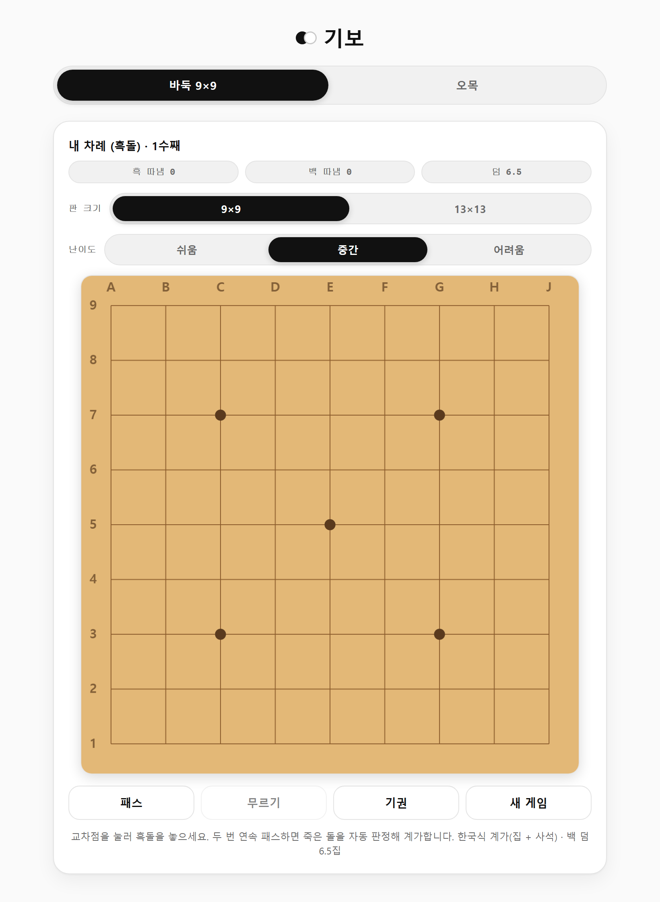
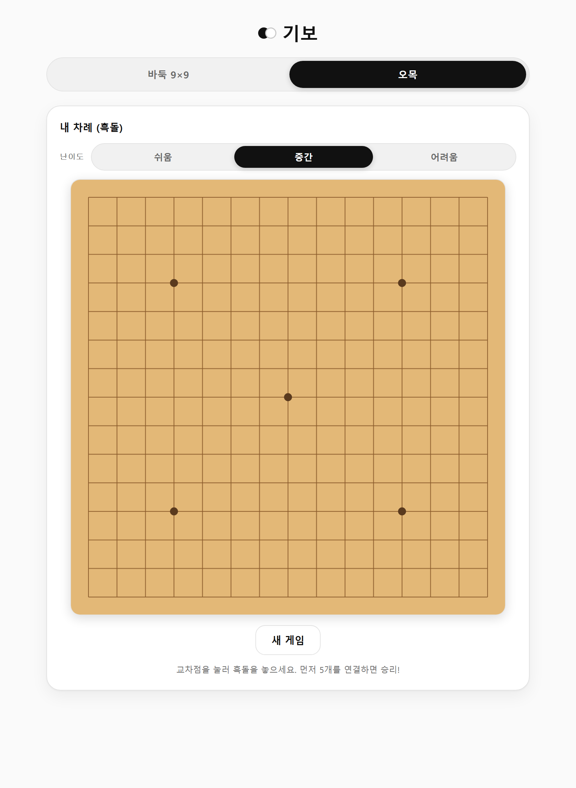

<h1 align="center">기보 — 바둑 &amp; 오목</h1>

<p align="center">
  브라우저에서 바로 즐기는 <b>바둑(9×9 · 13×13)</b>과 <b>오목(15×15)</b>.<br>
  서버 없이 돌아가는 순수 클라이언트 앱 · 모던 흑백 UI · 웹워커 기반 AI
</p>

<p align="center">
  <a href="https://05solar.github.io/GO/"><b>▶ 라이브 데모</b></a>
</p>

<p align="center">
  
  &nbsp;
  
</p>

---

## 특징

- **바둑** — 9×9 / 13×13 선택. 착수·따냄·자살수 금지·패(ko) 완전 구현, 두 번 패스 시 죽은 돌 자동 판정 후 **한국식 계가(집 + 사석)**.
- **오목** — 15×15. 5목 완성 승리, 즉시 승리/방어 감지.
- **난이도 3단계** (쉬움 · 중간 · 어려움) — 두 게임 모두.
- **반응형** — 화면 폭에 맞춰 판이 실시간으로 커지고 작아짐(모바일 ~ 데스크톱).
- **모던 흑백 UI** — 흰 배경 · 검정 포인트, 바둑판만 기존 나무색 유지.
- **오프라인/정적** — 백엔드가 전혀 없어 GitHub Pages 같은 정적 호스팅에서 그대로 작동.
- 착수 팝·따냄 페이드 애니메이션, 착수음(웹오디오), 무르기 지원(바둑).

## AI 설계

두 게임의 성격이 달라 서로 다른 방식을 씁니다. 무거운 탐색은 모두 **웹워커**에서 돌려 UI가 멈추지 않습니다.

| | 방식 |
|---|---|
| **바둑** | MCTS(몬테카를로 트리 탐색) + RAVE, 전술 롤아웃, **축(ladder) 읽기**, 어려움 난이도 폰더링(상대 생각 중 배경 탐색) |
| **오목** | 알파-베타 미니맥스 + **반복심화(iterative deepening)** + 강제수 탐색(4목 위협은 반드시 대응) |

> 바둑은 지식이 적은 넓은 탐색 공간이라 MCTS에 축 전술을 더했고, 오목은 좁고 전술적이라 알파-베타를 씁니다.

## 기술 스택

React · TypeScript · Vite · HTML5 Canvas · Web Workers

## 로컬 실행

```bash
npm install
npm run dev      # 개발 서버 (http://localhost:5173)
npm run build    # 프로덕션 빌드 → dist/
npm run preview  # 빌드 결과 미리보기
```

## 배포

`main` 브랜치에 push하면 **GitHub Actions**(`.github/workflows/deploy.yml`)가 자동으로 빌드해 GitHub Pages에 올립니다.

최초 1회 설정: 저장소 **Settings → Pages → Build and deployment → Source**를 **GitHub Actions**로 지정하세요.

> GitHub Pages는 `/GO/` 하위 경로로 서빙하므로 `vite.config.ts`의 `base`가 `/GO/`로 맞춰져 있습니다. 저장소 이름을 바꾸면 이 값도 함께 바꿔야 합니다.

## 프로젝트 구조

```
src/
  App.tsx / main.tsx      탭 전환, 앱 껍데기
  theme.css               모노크롬 디자인 토큰
  useSquareSize.ts        반응형 판 크기 측정 훅
  go/                     바둑: 엔진(go.ts) · 워커 · UI
  omok/                   오목: 엔진(omok.ts) · 워커 · UI
```
